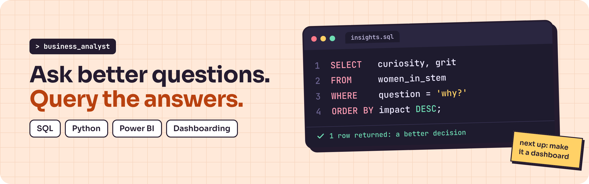
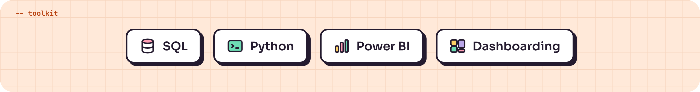

<p align="center">
  
</p>

```sql
-- about_me.sql
SELECT name, role, based_in, currently
FROM   me;
```

| name | role | based_in | currently |
| :--- | :--- | :--- | :--- |
| **Elecia Maria Dsouza** | Business Analyst | Mangaluru, India | Ex-Business Analyst Intern @ Amazon \| M.Sc. Applied Statistics |

I turn business questions into queries, and queries into dashboards people actually use. Proud woman in STEM, always asking *why?* before *how?*

<br>

<p align="center">
  
</p>

<!--
```sql
-- what_i_do.sql
SELECT skill, how_i_use_it
FROM   toolkit
ORDER  BY daily_use DESC;
```

| skill | how_i_use_it |
| :--- | :--- |
| **SQL** | [e.g. joining, cleaning and shaping data straight from the source] |
| **Python** | [e.g. pandas for analysis, automating the boring reports] |
| **Power BI** | [e.g. data models, DAX measures, interactive reports] |
| **Dashboarding** | [e.g. turning KPIs into views a stakeholder can read in 10 seconds] |

<br>
-->

## `> featured_projects`

| project | the question | built with |
| :--- | :--- | :--- |
| [**Consumer Shopping Behaviour Analysis**](https://github.com/Eleciadsouza/customer_behavior_analysis) | What purchasing patterns and customer segments can we identify from transactional data? | `Python` `pandas` `SQL` `Power BI`|
| [**Invioce Intelligence System**](https://github.com/Eleciadsouza/Invoice-Intelligence-ML-Project) | How can we predict freight costs and identify invoices that may require review? | `Python` `pandas` `Scikit-learn` |


<br>

<!--
## `> github_stats`

<p align="center">
  
  
</p>

<br>
-->

## `> lets_connect`

p>
  <a href="https://www.linkedin.com/in/elecia-maria-dsouza/">
    
  </a>
  <a href="mailto:eleciadsouza@gmail.com">
    
  </a>
  <a href="https://github.com/Eleciadsouza">
    
  </a>
</p>


<p align="center">
  
</p>


